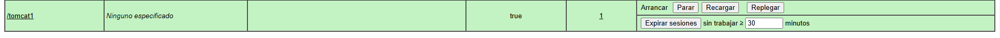

# Tomcat-y-Maven-Aplicaciones-Java

Este documento describe los pasos para configurar un entorno con **Tomcat 9 y Maven** en **Vagrant** con **Debian**.


## **1. Introducción**

En esta práctica realizaremos un despliegue de una aplicación Java usando Tomcat y Maven. Se utilizará **Tomcat 9** porque soporta **Java 8 y superiores**, siendo compatible con muchos proyectos reales.

## **2. Instalación de Tomcat**

### **Instalación de OpenJDK**

```bash
sudo apt install -y openjdk-11-jdk
```

### **Instalación de Tomcat**

```bash
sudo apt install -y tomcat9 tomcat9-admin
```

Verificar que el servicio está activo:

```bash
sudo systemctl status tomcat9
```

Crear grupo:

```bash
sudo groupadd tomcat9
```

Agregar usuario:

```bash
sudo useradd -s /bin/false -g tomcat9 -d /etc/tomcat9 tomcat9
```

Arranque y comprobación del servicio

Arrancaremos el servicio tomcat9:

```bash
sudo systemctl start tomcat9
```

Comprobamos que el servicio funciona correctamente

```bash
sudo systemctl status tomcat9
```

Accederemos al servicio en `http://localhost:8080/`


 Para solucionarlo sustituiremos el fichero context.xml del directorio `/usr/share/tomcat9-admin/host-manager/META-INF/` por el siguiente:

```bash
<?xml version="1.0" encoding="UTF-8"?>
<Context antiResourceLocking="false" privileged="true" >
  <CookieProcessor className="org.apache.tomcat.util.http.Rfc6265CookieProcessor"
                   sameSiteCookies="strict" />
  <Valve className="org.apache.catalina.valves.RemoteAddrValve"
         allow="\d+\.\d+\.\d+\.\d+" />
  <Manager sessionAttributeValueClassNameFilter="java\.lang\.(?:Boolean|Integer|Long|Number|String)|org\.apache\.catalina\.filters\.CsrfPreventionFilter\$LruCache(?:\$1)?|java\.util\.(?:Linked)?HashMap"/>
</Context>
```

## **3. Configuración de Administración**

### **Configuración de Usuarios en Tomcat**
Editar `/etc/tomcat9/tomcat-users.xml` y añadir:

```xml
<tomcat-users xmlns="http://tomcat.apache.org/xml"
              xmlns:xsi="http://www.w3.org/2001/XMLSchema-instance"
              xsi:schemaLocation="http://tomcat.apache.org/xml tomcat-users.xsd"
              version="1.0">
  <role rolename="manager-gui"/>
  <role rolename="admin-gui"/>
  <role rolename="manager-script"/>
  <user username="admin" password="password" roles="manager-gui,admin-gui,manager-script"/>
</tomcat-users>
```

Reiniciar Tomcat:

```bash
sudo systemctl restart tomcat9
```

## **4. Despliegue Manual mediante GUI**
1. Acceder a **http://192.168.57.102:8080/manager/html** con `admin/password`.


2. Buscar la opción para desplegar WAR.
3. Seleccionar `tomcat1.war` y hacer clic en **Deploy**.



## **5. Despliegue con Maven**

### **Instalación de Maven**

```bash
sudo apt-get update && sudo apt-get -y install maven
```


### **Configuración de Maven (`pom.xml`)**

```xml
<build>
  <finalName>miwebapp</finalName>
  <plugins>
    <plugin>
      <groupId>org.apache.tomcat.maven</groupId>
      <artifactId>tomcat7-maven-plugin</artifactId>
      <version>2.2</version>
      <configuration>
        <url>http://192.168.57.102:8080/manager/text</url>
        <server>Tomcat</server>
        <path>/miwebapp</path>
      </configuration>
    </plugin>
  </plugins>
</build>
```

### **Configuración de Credenciales de Maven (`settings.xml`)**
Ubicar `/etc/maven/settings.xml` y añadir:

```xml
<settings>
  <servers>
    <server>
      <id>Tomcat</id>
      <username>admin</username>
      <password>password</password>
    </server>
  </servers>
</settings>
```

### **Desplegar la Aplicación con Maven**

```bash
mvn clean package
mvn tomcat7:deploy
```

Para actualizar sin eliminar:

```bash
mvn tomcat7:redeploy
```

Para eliminar la aplicación:

```bash
mvn tomcat7:undeploy
```

## **6. Despliegue de Rock Paper Scissors en Tomcat con Vagrant**

Configura y despliega la aplicación **Rock Paper Scissors**.

### **Clonación del Proyecto Rock Paper Scissors**

Dentro de la máquina virtual, el repositorio se clonará automáticamente. Si deseas hacerlo manualmente, usa:

```sh
cd /home/vagrant
if [ ! -d "rock-paper-scissors" ]; then
  git clone https://github.com/cameronmcnz/rock-paper-scissors.git
fi
cd rock-paper-scissors
git checkout patch-1
```

### **Configuración de `pom.xml`**

El archivo `pom.xml` de `rock-paper-scissors` se reemplazará automáticamente con la versión configurada en `files/`. Si necesitas editarlo manualmente, usa:

```sh
nano /home/vagrant/rock-paper-scissors/pom.xml
```

Asegúrate de que incluya el siguiente bloque dentro de `<build>`:

```xml
<build>
    <finalName>rock-paper-scissors</finalName>
    <plugins>
        <plugin>
            <groupId>org.apache.tomcat.maven</groupId>
            <artifactId>tomcat7-maven-plugin</artifactId>
            <version>2.2</version>
            <configuration>
                <url>http://192.168.57.102:8080/manager/text</url>
                <server>Tomcat</server>
                <path>/rock-paper-scissors</path>
            </configuration>
        </plugin>
    </plugins>
</build>
```

### **Compilación y Despliegue en Tomcat**

Una vez configurado, ejecuta los siguientes comandos dentro de la VM para compilar y desplegar la aplicación:

```sh
cd /home/vagrant/rock-paper-scissors
mvn clean package
mvn tomcat7:deploy
```

Para verificar que la aplicación esté funcionando, abre un navegador y accede a:

http://192.168.57.102:8080/rock-paper-scissors


Si necesitas actualizar la aplicación sin eliminarla:

```sh
mvn tomcat7:redeploy
```

Para eliminarla completamente del servidor Tomcat:

```sh
mvn tomcat7:undeploy
```

### **Verificación y Depuración**

Para verificar que Tomcat está corriendo correctamente, usa:

```sh
systemctl status tomcat9
```

Si hay errores en la aplicación, revisa los logs de Tomcat:

```sh
sudo journalctl -u tomcat9 --no-pager | tail -n 50
```

También puedes verificar el estado del despliegue con:

```sh
mvn tomcat7:status
```

## **7. Verificación Final**
Verificar el estado del servicio:
```bash
sudo systemctl status tomcat9
```
Acceder a la aplicación en:

http://192.168.57.102:8080/miwebapp


